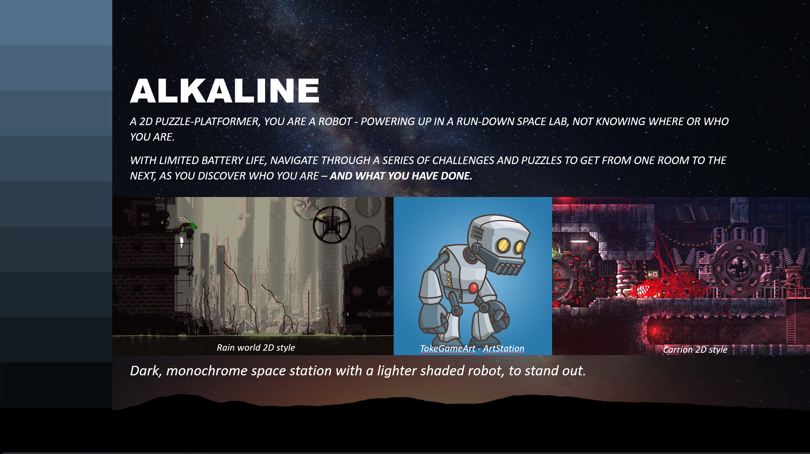

# Alkaline

### A 2D Puzzle-Platformer!

## Role: **Programmer, Level-Designer**

### First time working within a large team developing a game

## Game Documentation

##### Team Planning and communication was mostly done through Discord and in-person meetings.
##### A Notion page was also created to help organize team documents, ideas, planning, etc.

#### *Initial Draft presentation presented to rest of class and instructors*