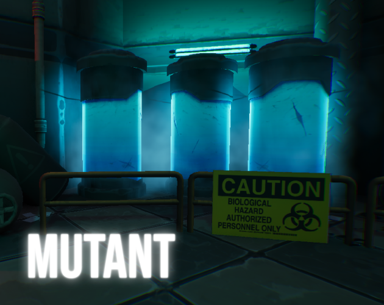
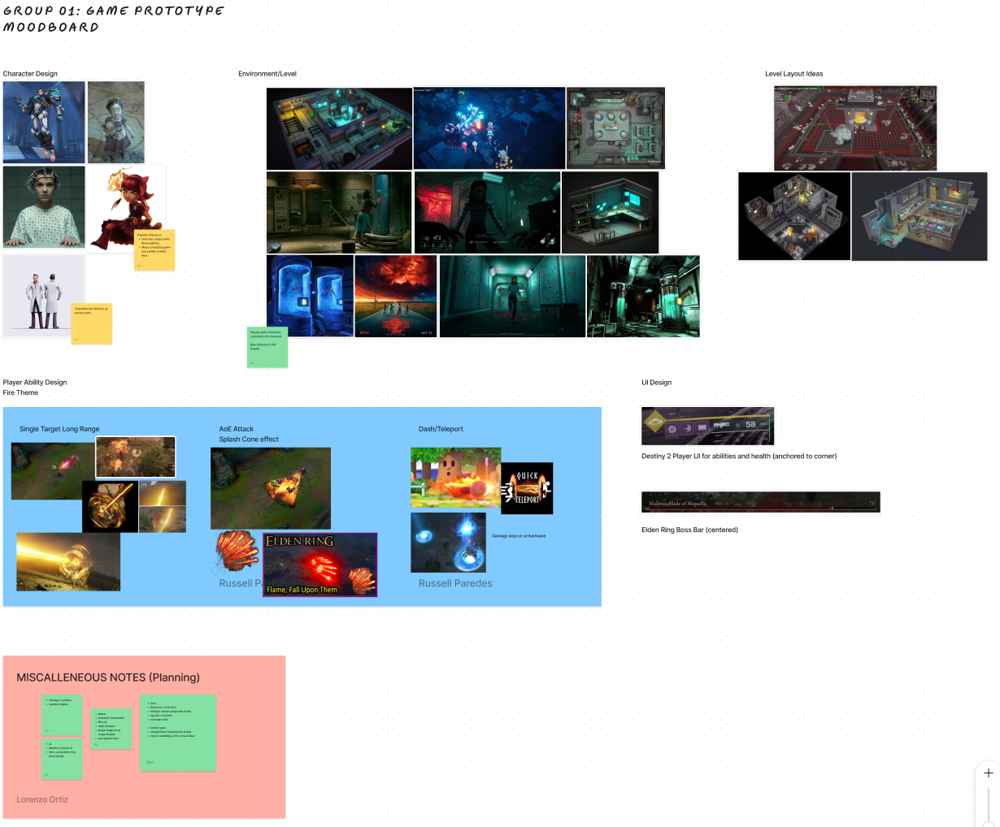
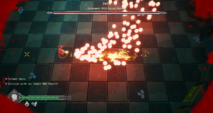
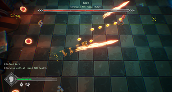

# **Mutant**

### A Top-down Shooter

## Role: **Programmer, Mechanic Designer**

### First time utlizing Unreal Engine to develop a game prototype

##### Alkaline is a 3-D top-down shooter set in a laboratory. Duel against Zero to determine who the strongest test subject is!

#### *Click the Image to play the game!*

## Game Documentation

##### Team Planning and communication was mostly done through Discord and in-person meetings.
##### A Notion page was also created to help organize team documents, ideas, planning, etc.

#### *Initial Draft presentation presented to rest of class and instructors*

## Game Development
##### The game was built between a team of 3 programmers and 3 artists. Complex level design and puzzle mechanics were my main focus for the game. 
 

### Level Design
##### In Regards to level design, multiple rounds of testing had to be done in order to see what a good level of difficulty was needed. On one hand I would setup levels that only 1/10 people could finish, while on the flip side, 10/10 would easily accomplish it. So finding that middle ground was much needed. 
##### Also, with the level framework we had built with all the puzzle mechanic and narrative we had created, I wanted to not only give players something set in stone, but also a vision of what possibilities Alkaline could possess. The potential puzzles that could be created with already created assets.

### Level Screenshots
     