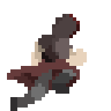

# Shadowhound

### An Atari style 2D time-based survival game!

## Role: **Designer, Programmer, Creator**

### First Game Created within *Unity* framework!

#### Originally created as a intro project to Unity during the Fall Term and being worked on as a side project during my free time. I had originally planned to create 4 main levels based on 4 elements for the game, but due to time constraints and overscoping I had to stick to the 

#### This was my first time utilizing the *Unity* framework, so although the game is only a single level at the moment, I hope to further develop levels for this project and expand more on it.

## Character Creation

##### With no art background and experience, creating a suitable player character required a more work.

##### I wanted my protagonist to have a mysterious aura, where the player would have suspicions about the nature of the protagonists background and motives. A mysterious shadow would be trailing behind them as they battled the various elementals.
    

