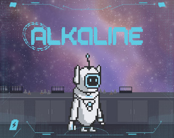
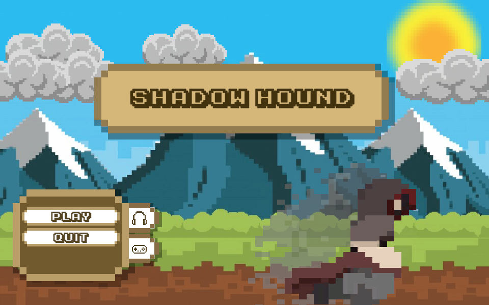

# About me

## Welcome to my Game Development Portfolio! 
I'm Russell Paredes, currently immersed in the first year of a two-year advanced diploma course, specializing in game development with a strong focus on programming. My passion lies in creating immersive and engaging gaming experiences that not only captivate players but also push the boundaries of interactive entertainment.

As you explore this repository, you'll encounter a diverse collection of projects that exemplify my dedication to innovation and craftsmanship in the realm of game development. From meticulously crafted 2D platformers to expansive 3D worlds, each project serves as a testament to my commitment to delivering captivating digital adventures.

Take a journey through the exciting realm of my creations and witness the evolution of my skills and creativity. Alongside my love for game design, you'll discover my proficiency in coding. I navigate the intricacies of game development using languages such as Python, Java, and C#. Join me as I tackle the challenges and celebrate the triumphs of my game development journey. Together, let's explore the vast realms of digital adventure!

## Projects
### Checkout my assortment of game projects that I have worked on below!

### 1. [Alkaline](./docs/Alkaline/Alkaline.html)
   - A 2-D Puzzle-Platformer where you, a robot, must discover who you are as navigate through a series of challenges and puzzles.

### 2. [Shadowhound](./docs/Shadowhound/Shadowhound.html)
   - An arcade like single level survival game. Outlast the time limit, as you face off against the air elemental!

### 3. [Circle of Hell](./docs/Game%20Of%20Life/Game%20Of%20Life.html)
   - A text-based choose your path journey. Can you escape unscathed?

## Additional Resources

For a comprehensive list of project URLs and additional information, visit the [Links & Resume](docs/Resume.html) page.

Feel free to contact me for collaboration opportunities or provide feedback. Let's continue shaping the future of gaming together!

----

[Just the Docs]: https://just-the-docs.github.io/just-the-docs/
[GitHub Pages]: https://docs.github.com/en/pages
[README]: [https://github.com/just-the-docs/just-the-docs-template/blob/main/README.md](https://github.com/StungEye-RRC/Just-The-Docs-Template#readme)
[Jekyll]: https://jekyllrb.com
[Markdown Syntax]: https://docs.github.com/en/get-started/writing-on-github/getting-started-with-writing-and-formatting-on-github/basic-writing-and-formatting-syntax
